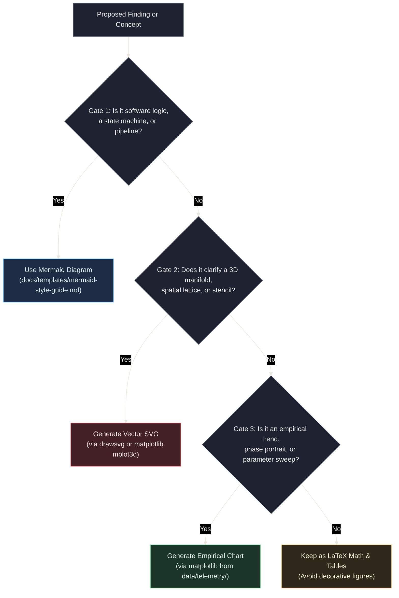

# Scientific Figures & Visualization Skill

The `scientific-figures` skill provides a domain-agnostic visualization framework for scientific and mathematical experimentation repositories. It bridges the gap between high-level architectural diagrams (handled by Mermaid) and complex spatial, continuous, topological, and empirical phenomena that require programmatic rendering.

---

## 1. Core Philosophy: The Cumulative Figure Repertoire

This skill operates on the principle that **every scientific repository is an instance of a broader experimentation template**. Rather than generating one-off or ad-hoc images:

1. **Reproducibility First**: Every figure committed to documentation MUST be 100% reproducible by executing a version-controlled Python script under `.venv/bin/python`.
2. **Repertoire Growth**: When an agent encounters a mathematical or empirical concept that requires visualization, it is **explicitly empowered to author a new modular Python script or adapt an existing archetype**. Over time, the repository organically accumulates a specialized, reusable visualization library.
3. **Dark Theme Consistency**: Every figure programmatically adheres to the repository's dark theme specification (`#161922` dark canvas, `#1e2230` panel, and gentle RGB accents), ensuring visual harmony across GitHub dark mode and VS Code previews.

---

## 2. The 4-Gate Decision Rubric: When to Visualize

To prevent visual clutter and maintain strict documentation discipline, apply this 4-gate rubric before generating any figure:



### Invariants

- **Strict Value-Add Rule**: Do not generate figures for relationships easily expressed in a 2-line equation or compact Markdown table.
- **Document Budget**: Maximum **1 to 2 figures** per Hypothesis (`HYP-*`), Protocol (`EXP-*`), or Diagnostic (`DIAG-*`).
- **Format Standard**: Use vector **SVG (`.svg`)** for 90% of figures (crisp, scalable, diffable). Reserve **300 DPI PNG (`.png`)** strictly for dense 3D shaded meshes or massive micro-state heatmaps (>10,000 cells).

---

## 3. Four Universal Scientific Archetypes

The skill provides foundational, parameterized starter archetypes located in `.github/skills/scientific-figures/scripts/archetypes/` (or `.agents/skills/scientific-figures/scripts/archetypes/`):

| Archetype | Script | Core Mathematical / Empirical Concepts | Typical Use Cases |
| :--- | :--- | :--- | :--- |
| **1. Continuous Manifolds & Surfaces** | `surface_3d.py` | Parametric surfaces $\mathbf{r}(u,v)$, 3D embeddings, energy landscapes, potential wells | 3D Torus, Sphere, saddle landscapes, loss surfaces |
| **2. Discrete Substrates & Topologies** | `lattice_grid_2d.py` | 2D/3D grids, periodic boundary wrap-around, neighborhood stencils (von Neumann, Moore) | CA lattices, network routing, connectomes |
| **3. Dynamical Systems & Phase Spaces** | `phase_space.py` | Vector fields, streamplots, nullclines, limit cycles, attractor basins | Phase portraits, fixed-point stability, orbital limit cycles |
| **4. Empirical Telemetry & Reductions** | `telemetry_timeseries.py` | Multi-panel time series with critical stability bands, parameter sweeps, box/bar distributions | Critical firing density, noise resilience sweeps, ablation comparisons |

---

## 4. The Agent Protocol: Survey, Adapt, or Author

When an agent needs a scientific figure, it must follow this 4-step workflow:

### Step 1: Survey

Inspect existing scripts in:

1. `python/scripts/figures/` (the repository's current repertoire gallery)
2. `.github/skills/scientific-figures/scripts/archetypes/` (or `.agents/skills/scientific-figures/scripts/archetypes/`)

Check [`python/scripts/figures/README.md`](file:///workspaces/ca-experiment/python/scripts/figures/README.md) to see if a similar visual generator already exists.

### Step 2: Adapt or Author

- **Adapt**: If an existing script performs 80% of what is needed, add command-line arguments (via `argparse`) or configure its parameters so it can be reused without code duplication.
- **Author**: If a novel visual mechanism is required (e.g. wavefront collision diagrams, chiral highway rings, bifurcation trees), the agent is **explicitly authorized to create a new script** in `python/scripts/figures/`:
  - Import the dark palette and utilities: `from tools.viz import apply_dark_theme, save_figure, DARK_CANVAS, PRIMARY_RED, ...`
  - Accept parameters via CLI arguments (`--output`, `--seed`, etc.).
  - Output to `docs/assets/figures/` (for architecture/general) or `docs/research/assets/` (for experiments).

### Step 3: Execute & Validate

Run the script using the workspace Python environment:

```bash
.venv/bin/python python/scripts/figures/your_script.py --output docs/research/assets/fig-id-desc.svg
```

Validate the generated asset using the skill's validation script **in strict mode** (accessible via either `.github/skills/` or `.agents/skills/`):

```bash
.venv/bin/python .github/skills/scientific-figures/scripts/validate_figure.py --strict docs/research/assets/fig-id-desc.svg
```

If any WARNING appears, the figure **MUST** be fixed before committing. Common warnings include:

- **Vertical canvas overflow**: Text renders below the SVG canvas boundary.
- **Container overflow**: Text exceeds its enclosing card or panel rect.
- **Text collision**: Two text elements overlap vertically.
- **Raw underscores**: Programming-style identifiers used instead of Unicode subscripts.

### Step 4: Register & Embed

1. **Catalog Entry**: Append an entry to [`python/scripts/figures/README.md`](file:///workspaces/ca-experiment/python/scripts/figures/README.md) listing:
   - Script path and CLI usage
   - Output asset path
   - Target documents that embed it
2. **Markdown Embedding**: Embed the figure in the target document using standard Markdown syntax:

   ```markdown
   
   ```

### Compositing 2D Schematics with 3D Renders

When a figure requires both flat 2D schematic elements (grids, stencils, flow diagrams) AND 3D surface renders (torus, saddle, energy landscape):

1. **Never fake 3D** with 2D primitives (ellipses, arcs) in DrawSVG. The result always looks flat and unconvincing.
2. **Generate separate files**: Render the 3D part with matplotlib (`plot_surface` from `mplot3d`) as a companion **300 DPI PNG**. Keep the 2D schematic as a pure **vector SVG** in DrawSVG.
3. **Git-friendly separation**: This approach keeps SVGs text-diffable and avoids embedding base64 raster blobs inside XML.
4. **Reference companion files**: The schematic SVG may include a text reference to the companion 3D render. The target Markdown document embeds both files.
5. **Naming convention**: Use the same figure ID prefix with a `-3d` suffix for the companion render (e.g., `fig-hyp-001-torus-manifold.svg` + `fig-hyp-001-torus-3d.png`).

---

## 5. Quality & Mathematical Typography Invariants

All figure authoring agents must enforce the following invariants:

1. **No Raw Code Identifiers in Labels**:
   Never use raw programming syntax with underscores (`v_0`, `W_ij`, `d_in`, `R_i`, `N_ref`) or raw exponential strings (`1e-12`, `1e-32`).
   - In DrawSVG: Use Unicode subscripts (`v₀, v₁, ..., v₁₅`, `Wᵢⱼ`, `dᵢₙ`) and Unicode math symbols (`ℤ₄ × ℤ₄`, `𝕋²`, `10⁻¹²`).
   - In Matplotlib: Use LaTeX mathtext (`$v_0$`, `$W_{ij}$`, `$\mathbb{Z}_4 \times \mathbb{Z}_4$`, `$\mathbb{T}^2$`, `$10^{-12}$`).
2. **Container Width Budgeting & Multi-Line Text**:
   SVG `<text>` does NOT wrap. Never place long text strings into fixed-width cards. Always wrap descriptions into structured multi-line entries using `draw_card_with_bullets` or `wrap_text` from `tools.viz`. Ensure minimum 15px canvas margin.
3. **High-Contrast Light Typography on Dark Canvas**:
   Never render black or near-black text, tick lines, tick labels, or error bars (`#000000`, `black`) against the `#161922` canvas or `#1e2230` panels. Always use `TEXT` (`#e2e8f0`) for primary text and `TEXT_MUTED` (`#94a3b8`) for tick marks, tick labels, and error bars. In Matplotlib, always call `apply_dark_theme(fig, ax)`, and pass `error_kw=dict(ecolor=TEXT_MUTED)` when drawing error bars.
4. **Automated Linter Enforcement**:
   Always run `.venv/bin/python .github/skills/scientific-figures/scripts/validate_figure.py --strict <path>` (or `.agents/skills/scientific-figures/scripts/validate_figure.py`). The script checks for syntax, palette, size, unescaped underscores, text frame overflow, vertical/container clipping, and unstyled black elements.

### Rule 5: Layout Budgeting & Overflow Prevention

Before writing any DrawSVG figure with text-heavy panels:

1. **Pre-measure card content**: Call `measure_card_with_bullets(entries, title=..., max_chars=...)` to calculate required height before allocating canvas space.
2. **Size canvas dynamically**: Use `auto_size_canvas(panels)` to compute minimum canvas dimensions rather than hardcoding width/height values.
3. **Verify containment**: After generation, run `validate_figure.py --strict` to ensure all text stays within its container and within the canvas bounds.

```python
from tools.viz import measure_card_with_bullets, auto_size_canvas

# Calculate content requirements before creating the Drawing
required_height = measure_card_with_bullets(bullets, title="My Card", max_chars=44)
canvas_w, canvas_h = auto_size_canvas([
    {'x': 10, 'y': 80, 'width': 500, 'height': 400},
    {'x': 530, 'y': 80, 'width': 400, 'height': required_height + 200},
])
```

---

## 6. Technical Palette Reference

All figures MUST import and use the repo's dark theme palette from `tools.viz`:

```python
from tools.viz import (
    DARK_CANVAS,       # "#161922" (Canvas background)
    DARK_PANEL,        # "#1e2230" (Axes and panel fill)
    BORDER,            # "#434c5e" (Spines and bounding borders)
    GRID,              # "#33394a" (Subtle grid lines)
    TEXT,              # "#e2e8f0" (Primary text / titles)
    TEXT_MUTED,        # "#94a3b8" (Ticks and subtitles)
    PRIMARY_RED,       # "#e06c75" (Core domain, active condition, invariants)
    SECONDARY_GREEN,   # "#73c991" (Critical target bands, active channels)
    TERTIARY_BLUE,     # "#61afef" (Infrastructure, baseline / control condition)
    AMBER,             # "#e5c07b" (Callouts, warnings, ablation conditions)
    apply_dark_theme,  # Automatically configures Matplotlib figures and axes
    save_figure,       # Exports SVG/PNG with dark background and tight bounds
)
```
