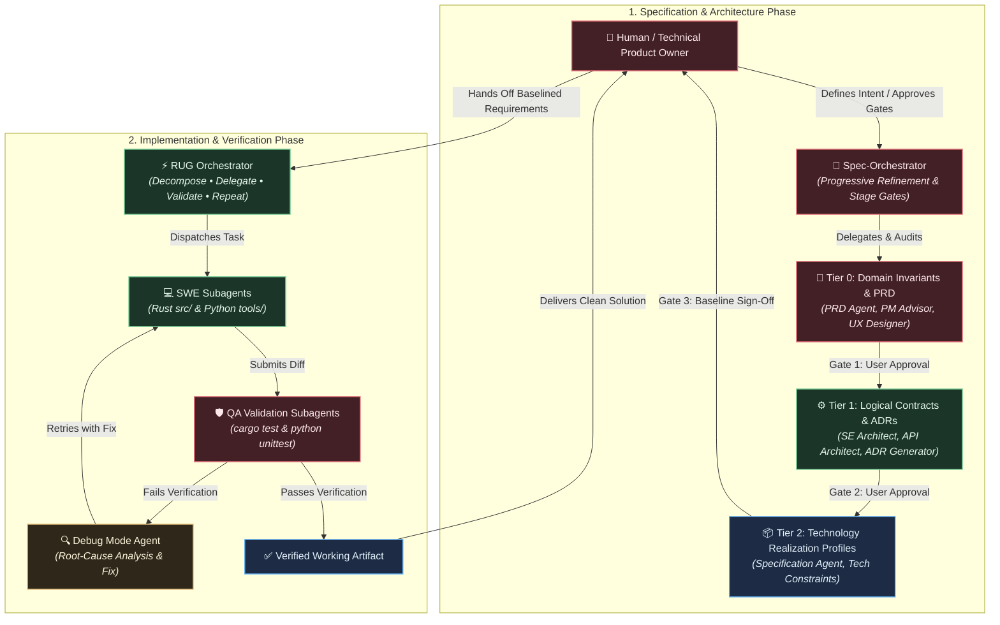
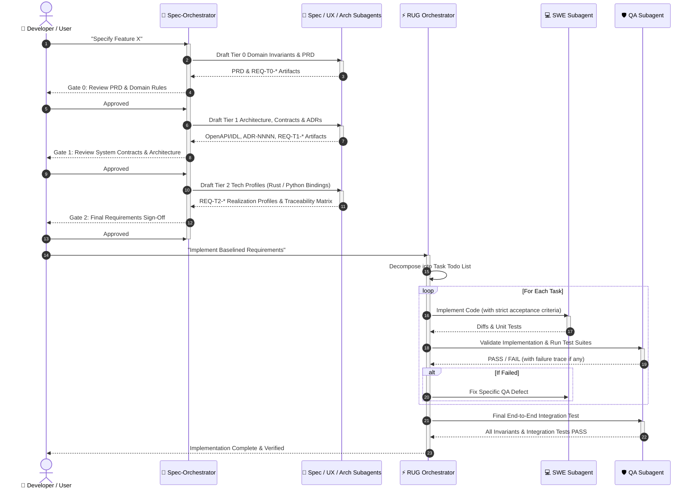

# Rust & Python Agentic Engineering Template

> A template and multi-agent orchestration framework for specification-driven systems development in Rust and Python.

---

## 🌟 Overview

This repository is a **starter template** designed for teams and engineers building software systems using AI-assisted, specification-first workflows. It combines a dual-language runtime environment (**Rust** for high-performance, memory-safe core logic; **Python** for rapid tooling, analysis, and data scripts) with a suite of specialized **GitHub Copilot / Antigravity Agent Orchestrators**.

Instead of prompting an LLM to generate unstructured code on the fly, this template implements a disciplined **Orchestrator-Subagent Lifecycle**:
1. **Spec-Orchestrator** drives human-in-the-loop progressive refinement from user intent and business invariants to concrete logical contracts and technology realization profiles.
2. [**RUG ("Repeat Until Good") Orchestrator**](https://github.com/github/awesome-copilot/blob/main/agents/rug-orchestrator.agent.md) decomposes specifications into discrete tasks, delegates code generation to focused software engineering subagents, runs independent validation subagents, and iterates until all verification criteria pass.



---

## 🏛️ Top-Level Orchestrators

The repository defines two primary top-level orchestrators located in `.github/agents/`:

### 1. `Spec-Orchestrator` — Requirements & Architecture Director
- **Role**: Drives the end-to-end specification lifecycle from high-level product intent down to testable engineering contracts.
- **Cardinal Rule**: **Never guesses user intent on architectural fork points or trade-offs**. Formulates trade-off matrices (options, pros/cons, recommendations) and halts at explicit human-in-the-loop decision gates.
- **Workflow (Align $\rightarrow$ Draft $\rightarrow$ Audit $\rightarrow$ Gate)**:
  1. *Clarify*: Asks targeted scoping questions.
  2. *Draft*: Dispatches specialist subagents (PRD, UX Designer, API Architect, ADR Generator).
  3. *Audit*: Dispatches independent validation subagents (QA, Security, Architecture Reviewer) to check EARS syntax, NASA modal verbs, testability, and boundary isolation.
  4. *Gate*: Presents proposal diffs to the human user for formal approval before cascading down to lower tiers.

### 2. `RUG` ("Repeat Until Good") — Pure Implementation Orchestrator
- **Role**: Manages implementation and test verification without ever doing direct coding in the orchestrator's context window.
- **Cardinal Rule**: **Never writes code directly**. Context window tokens are preserved purely for orchestration, decomposition, and state tracking.
- **Workflow**:
  1. *Decompose*: Breaks down requirements into focused, single-concern tasks (e.g., one file/module per task).
  2. *Delegate*: Launches `SWE` or `Rust MCP Expert` subagents with comprehensive prompts (context, exact file scopes, explicit constraints, non-negotiable technologies).
  3. *Validate*: Launches independent `QA` subagents to inspect code, run tests, verify acceptance criteria, and ensure strict specification adherence.
  4. *Repeat*: If validation fails, feeds exact diagnostic output into a fresh subagent until tests and quality gates pass.

---

## 🔄 End-to-End Workflow: From Idea to Working Code



---

## 🤖 Agent & Skills Catalog

The agent definitions are available in three complementary formats:
1. **Antigravity Custom Agents & Subagents** (`.agents/agents/`): Defined with `subagent: true` (and `mainAgent: true` for top-level orchestrators), enabling isolated context delegation via `invoke_subagent` and management in the `/agents` panel.
2. **Antigravity Skills** (`.agents/skills/`): On-demand procedures and interactive slash commands (`/<skill-name>`).
3. **GitHub Copilot Agents** (`.github/agents/`): Adapted from the collection at [`awesome-copilot/agents`](https://github.com/github/awesome-copilot/tree/main/agents).

| Antigravity Subagent | Skill / Command | Copilot Agent File | Role / Mode | Purpose & Focus Areas |
|:---|:---|:---|:---|:---|
| [`spec-orchestrator.md`](.agents/agents/spec-orchestrator.md) | `/spec-orchestrator` | [`spec-orchestrator.agent.md`](.github/agents/spec-orchestrator.agent.md) | **Orchestrator** | Requirements engineering director; human-in-the-loop multi-tier spec decomposition and gating. |
| [`rug-orchestrator.md`](.agents/agents/rug-orchestrator.md) | `/rug-orchestrator` | [`rug-orchestrator.agent.md`](.github/agents/rug-orchestrator.agent.md) | **Orchestrator** | Pure execution orchestrator; decomposes tasks, delegates to subagents, validates, and iterates ("Repeat Until Good"). |
| [`prd.md`](.agents/agents/prd.md) | `/create-prd` | [`prd.agent.md`](.github/agents/prd.agent.md) | Product Management | Authors structured PRDs (`docs/product/`) and extracts Tier 0 functional requirements. |
| [`se-product-manager.md`](.agents/agents/se-product-manager.md) | `/se-product-manager` | [`se-product-manager-advisor.agent.md`](.github/agents/se-product-manager-advisor.agent.md) | Product Advisor | Hypotheses validation, Jobs-to-be-Done alignment, and GitHub issue breakdown with business context. |
| [`se-ux-designer.md`](.agents/agents/se-ux-designer.md) | `/se-ux-designer` | [`se-ux-ui-designer.agent.md`](.github/agents/se-ux-ui-designer.agent.md) | UX Research & Design | JTBD analysis, user journey mapping (`docs/ux/`), flow specifications, and accessibility checklists. |
| [`se-architect.md`](.agents/agents/se-architect.md) | `/se-architect` | [`se-system-architecture-reviewer.agent.md`](.github/agents/se-system-architecture-reviewer.agent.md) | Architecture Review | Well-Architected framework validation (reliability, scalability, AI systems, data pipelines). |
| [`adr-generator.md`](.agents/agents/adr-generator.md) | `/adr-generator` | [`adr-generator.agent.md`](.github/agents/adr-generator.agent.md) | Architecture Decision | Trade study analysis and standardized ADR generation (`docs/architecture/adr-NNNN-*`). |
| [`api-architect.md`](.agents/agents/api-architect.md) | `/api-architect` | [`api-architect.agent.md`](.github/agents/api-architect.agent.md) | API & Contracts | REST/gRPC service interfaces, resilience patterns (circuit breakers, rate limiting, bulkheads). |
| [`specification.md`](.agents/agents/specification.md) | `/specification` | [`specification.agent.md`](.github/agents/specification.agent.md) | Requirements Authoring | Dual-mode authoring of formal r9ts requirements (`docs/requirements/`) and freeform architecture docs. |
| [`se-security.md`](.agents/agents/se-security.md) | `/se-security` | [`se-security-reviewer.agent.md`](.github/agents/se-security-reviewer.agent.md) | Security Review | OWASP Top 10, OWASP LLM Top 10, Zero Trust enforcement, cryptographic hygiene, and code review reports. |
| [`swe.md`](.agents/agents/swe.md) | `/swe` | [`swe-subagent.agent.md`](.github/agents/swe-subagent.agent.md) | Implementation (SWE) | Senior full-stack engineer producing clean, idiomatic, test-backed diffs in Rust and Python. |
| [`rust-mcp-expert.md`](.agents/agents/rust-mcp-expert.md) | `/rust-mcp-expert` | [`rust-mcp-expert.agent.md`](.github/agents/rust-mcp-expert.agent.md) | MCP & Async Rust | Specialized in Model Context Protocol (MCP) servers using the official Rust `rmcp` SDK and Tokio. |
| [`qa.md`](.agents/agents/qa.md) | `/qa` | [`qa-subagent.agent.md`](.github/agents/qa-subagent.agent.md) | Quality Assurance | Adversarial test planning, boundary/concurrency testing, and independent verification of acceptance criteria. |
| [`debug.md`](.agents/agents/debug.md) | `/debug` | [`debug.agent.md`](.github/agents/debug.agent.md) | Systematic Debugging | 4-phase structured debugging: Problem assessment, reproduction, root-cause investigation, and fix verification. |

---

## 📐 Requirements Engineering Standard (r9ts)

This template adheres to formal graph-driven requirements engineering principles:

### Three-Tier Abstraction Model
1. **Tier 0 — Domain & Functional Invariants**: Technology-agnostic business rules. Describes *what* the system does, never *how* (e.g., `REQ-T0-AUTH-001`).
2. **Tier 1 — Logical Architecture & Contracts**: Technology-neutral component boundaries, IDL schemas, QoS budgets, and state transitions (e.g., `REQ-T1-API-002`).
3. **Tier 2 — Technology Realization Profiles**: Stack-specific constraints induced by selected technologies like Rust, Tokio, Neo4j, Axum, or Python (`is_derived: true`).

### Syntax & Modal Verbs
- **EARS Syntax**: Ubiquitous (`The <system> SHALL...`), Event-driven (`When <event>, the <system> SHALL...`), State-driven (`While <state>, the <system> SHALL...`), Optional (`Where <feature>, the <system> SHALL...`), and Unwanted/Error (`If <condition>, then the <system> SHALL...`).
- **NASA Modal Verbs**: **SHALL** (mandatory, verifiable), **SHOULD** (goal/non-binding), **MAY** (discretionary).
- **Quality Criteria**: Atomic (single subject & predicate), Quantified (explicit measurable metrics), Implementation-free (for Tier 0/1), and free of vague terms (*fast*, *user-friendly*, *robust*, *easy*).
- **NASA TADI Verification Methods**: Every mandatory requirement specifies its verification method: **Test**, **Analysis**, **Demonstration**, or **Inspection**.

### Requirement File Format (`docs/requirements/`)
```yaml
---
id: REQ-T0-DATA-001
title: "Deterministic Requirement State Transitions"
tier: 0
binding: shall
category: functional
priority: critical
verification_method: [test, inspection]
status: draft
is_derived: false
traces_to: [OBJ-001]
refines: []
allocated_to: [COMP-ENGINE]
---

## Statement
When a requirement status transition is requested, the system SHALL reject transitions not defined in the valid status lifecycle.

## Rationale
Prevents invalid lifecycle skips and preserves audit trail immutability.

## Verification Criteria
Unit tests verify that attempting to transition directly from Draft to Verified returns an InvalidStateTransition error.
```

---

## 📁 Repository Layout

```text
.
├── .agents/                   # Antigravity agent customizations
│   ├── agents/                # Custom subagents (subagent: true, invoke_subagent)
│   └── skills/                # Modular skills & slash commands (/<skill-name>)
├── .devcontainer/             # Devcontainer configuration (Rust, Python, Docker services)
│   ├── devcontainer.json
│   ├── docker-compose.yml     # PostgreSQL and Neo4j development services
│   └── Dockerfile
├── .github/
│   ├── agents/                # GitHub Copilot agent definitions
│   │   ├── spec-orchestrator.agent.md
│   │   ├── rug-orchestrator.agent.md
│   │   └── ... (specialist subagents)
│   └── copilot-instructions.md
├── docs/                      # Freeform and structured documentation
│   ├── architecture/          # Architecture docs & ADRs (adr-NNNN-[slug].md)
│   ├── design/                # Freeform design specifications
│   ├── product/               # PRDs, journey maps, feature discovery
│   ├── requirements/          # Formal r9ts requirements (one file per requirement)
│   ├── templates/             # Mermaid styling and diagram templates
│   │   ├── diagram-template.md
│   │   └── mermaid-style-guide.md
│   └── ux/                    # JTBD analysis, user flows, and UX research
├── python/                    # Python package and scripts
│   ├── pyproject.toml         # Python build config & dependencies
│   ├── src/tools/             # Reusable Python tools package (importable as `tools`)
│   └── tests/                 # Python unit tests
├── src/                       # Rust codebase
│   └── main.rs                # Rust binary entrypoint
├── tests/                     # Rust integration tests
├── Cargo.toml                 # Rust package manifest (Rust 2024 edition)
├── GEMINI.md                  # Context & behavioral guidelines for Gemini / Antigravity
└── README.md                  # Project overview & orchestrator documentation
```

---

## 🚀 Getting Started

### Prerequisites
- **Devcontainer / VS Code / Cursor** (recommended): Open in the provided devcontainer which comes pre-configured with Rust (1.98+ / 2024 edition), Python 3.11+, Cargo tools, and `.venv`.
- **Local Toolchains**:
  - Rust: `rustup default stable` (or see `rust-toolchain.toml`)
  - Python: `python3 -m venv .venv && .venv/bin/pip install -e python/`

### Validation & Testing Commands

Before submitting code or closing orchestration tasks, always validate the appropriate surfaces:

#### Rust Changes
```bash
# Format check
cargo fmt --check

# Lints & clippy analysis
cargo clippy

# Run all tests
cargo test

# Run tests skipping intentional authentication timeouts (saves ~40s)
cargo test -- --skip configured_authentication
```

#### Python Changes
```bash
# Run Python unit tests
.venv/bin/python -m unittest discover -s python/tests -v
```

### Docker Services
PostgreSQL and Neo4j are defined in `.devcontainer/docker-compose.yml`. They are not started by default:
```bash
# Start background services when needed
docker compose -f .devcontainer/docker-compose.yml up -d
```

Credentials and connection strings are read directly from standard environment variables (`DATABASE_URL`, `NEO4J_URI`, `NEO4J_USERNAME`, `NEO4J_PASSWORD`, etc.).

---

## 🎨 Diagramming Style Guide

All architectural and workflow diagrams in documentation must use Mermaid and adhere to the project's **Gentle RGB Dark Theme**:
- `:::primary` (Rosewood Red `#422026` / `#e06c75`): Core domain, invariants, decision gates, entry points.
- `:::secondary` (Forest Sage Green `#1b3528` / `#73c991`): Application services, coordinators, active pipelines.
- `:::tertiary` (Royal Slate Blue `#1d2c44` / `#61afef`): Storage, databases, adapters, external boundaries.
- `:::note` (Muted Amber `#2e271a` / `#e5c07b`): Security constraints, verification guards, callouts.

See [`docs/templates/mermaid-style-guide.md`](docs/templates/mermaid-style-guide.md) and [`docs/templates/diagram-template.md`](docs/templates/diagram-template.md) for full examples and copy-pasteable boilerplates.

---

## 📄 License

Distributed under the [MIT License](LICENSE).
