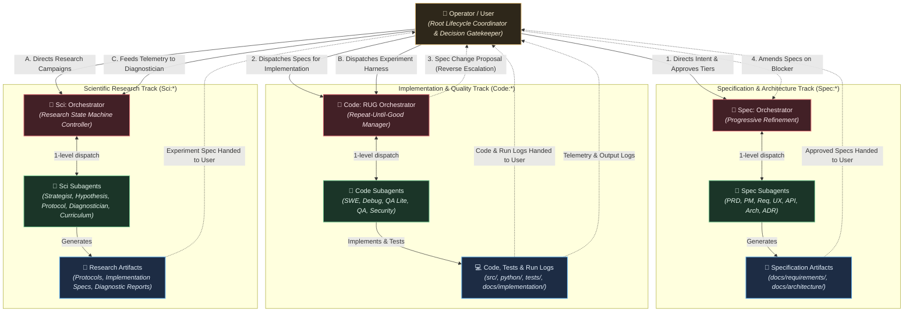
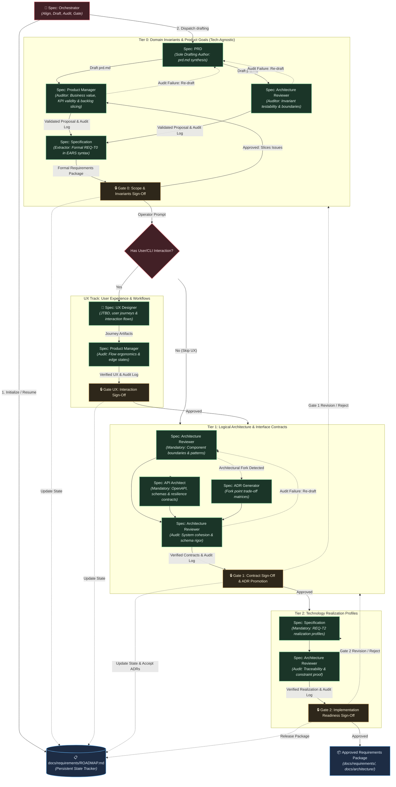
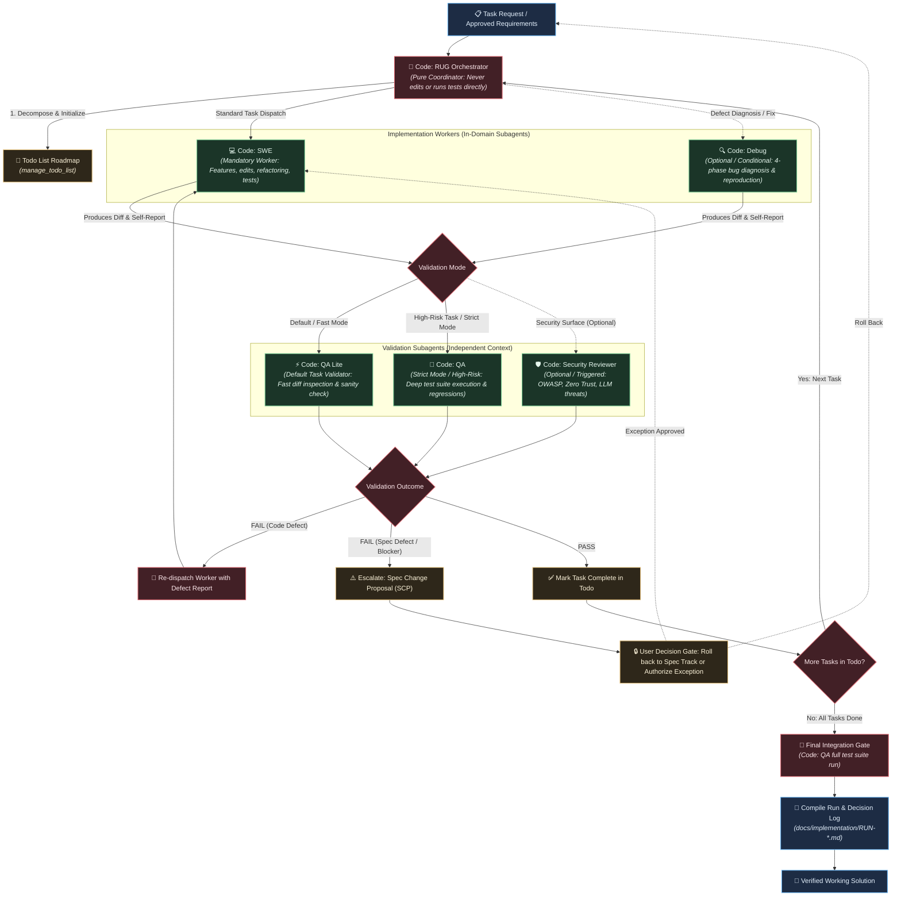
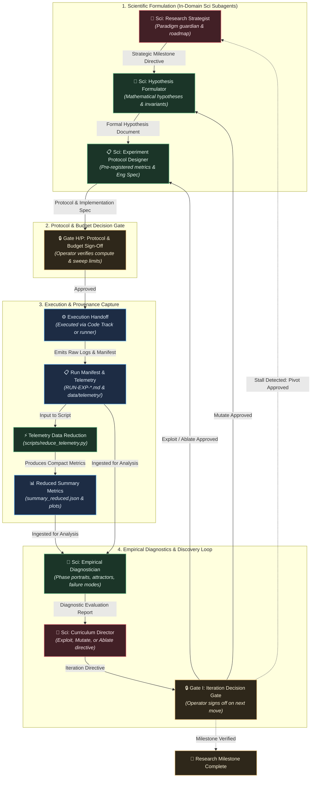

# Rust & Python Agentic Engineering Template

> A template and multi-agent orchestration framework for specification-driven systems development in Rust and Python.

---

## 🌟 Overview

This repository is a **starter template** designed for teams and engineers building software systems using AI-assisted, specification-first workflows. It combines a dual-language runtime environment (**Rust** for high-performance, memory-safe core logic; **Python** for rapid tooling, analysis, and data scripts) with a suite of specialized **GitHub Copilot / Antigravity Agent Orchestrators**.

The agent suite is structured into three strictly decoupled, domain-bounded tracks:

1. **Specification & Architecture Track (`Spec:*`)**: Progressively refines human intent into formal domain invariants, user experience journeys, logical interface contracts, and technology realization profiles with explicit human-in-the-loop decision gates.
2. **Implementation & Quality Track (`Code:*`)**: Operates on a strict **Repeat Until Good (RUG)** protocol—decomposing tasks, dispatching implementation workers, and subjecting every change to multi-tiered automated verification.
3. **Scientific Research Track (`Sci:*`)**: Drives hypothesis formulation, rigorous empirical experiment protocols, and dynamical systems diagnostics, translating abstract research designs into standardized experiment implementation specifications.

---

## 🏛️ Architectural Guardrails: Depth & Domain Boundaries

To prevent recursion, runaway execution, and architectural confusion, the multi-agent system enforces two foundational design constraints:

### 1. The 1-Level Subagent Depth Constraint

In modern coding agent platforms (including GitHub Copilot and VS Code agents), subagent delegation is strictly **one level deep**:

$$\text{Operator / User} \longrightarrow \text{Lead Orchestrator} \longrightarrow \text{Leaf Subagent}$$

- Subagents **cannot** invoke further subagents. Nested delegation is disabled to eliminate the risk of unbounded recursion, cyclical execution loops, and runaway context window costs.
- Orchestrators **cannot** call orchestrators from other groups. Because an orchestrator requires root management privileges to decompose tasks and launch workers, running an orchestrator inside another orchestrator causes delegation failure.
- The **Operator / User** acts as the overarching lifecycle coordinator, invoking orchestrators sequentially across track boundaries.

### 2. Strict Domain Encapsulation (Zero Cross-Group Calls)

Every agent belongs to exactly one track (`Spec:*`, `Code:*`, or `Sci:*`) and operates strictly within its domain:

- **`Spec:*` Agents** never write runtime code, execute test suites, or dispatch `Code:*` subagents.
- **`Code:*` Agents** never author abstract requirements documents or dispatch `Spec:*` subagents.
- **`Sci:*` Agents** never implement code harnesses or dispatch `Code:*` subagents.
- **Inter-Track Collaboration** is achieved exclusively via **standardized, typed file artifacts** passed across user-mediated stage gates.

---

## 🤖 Multi-Agent System Architecture

The following diagram illustrates how the three decoupled agent tracks interact with the user and exchange artifacts across track boundaries:



---

## 📐 Specification & Architecture Track (`Spec:*`)

The **Specification Track** governs the transition from ambiguous human requirements to verifiable software contracts. Led by [`Spec: Orchestrator`](.github/agents/spec-orchestrator.agent.md), it enforces:

- **Pure Specification Scope**: Focuses strictly on problem framing, domain modeling, interface schemas, and realization constraints. Never writes executable runtime code.
- **Persistent State Across Sessions**: Maintains a durable specification tracker in `docs/requirements/ROADMAP.md` (instantiated from `docs/templates/spec-roadmap-template.md`), capturing stage completions, gate timestamps, approved requirement ranges, and open forks.
- **In-Domain Quality Audits**: Auditing is performed within the track (`Spec: Product Manager` audits business value and scope discipline; `Spec: Architecture Reviewer` verifies system boundaries, security, and schema rigor). Auditors generate durable reports in `docs/requirements/audits/AUDIT-T{tier}-*.md`.
- **ADR Governance & Central Registry**: Evaluates architectural fork points via [`Spec: ADR Generator`](.github/agents/spec-adr-generator.agent.md), registers them in [`docs/architecture/README.md`](docs/architecture/README.md), and promotes them from `Proposed` to `Accepted` upon user sign-off at Gate 1 or Gate 2.
- **Human Decision Gates & Invalidation Discipline**: Progresses only upon explicit operator sign-off against structured gate verification checklists. If revisions occur, downstream artifacts are invalidated before re-drafting.

### Specification Refinement Workflow



### `Spec:*` Subagents Catalog

| Agent Name | Role | Call Nature | Inputs | Primary Deliverables |
| :--- | :--- | :--- | :--- | :--- |
| **`Spec: Orchestrator`** | Master Specification Manager | **Orchestrator** | User goal, roadmap | Decomposed plan, persistent `ROADMAP.md`, stage gates, ADR promotions |
| **`Spec: PRD`** | Sole Tier 0 Drafting Author | **Mandatory (Tier 0 Author)** | User intent, scope | `prd.md` (10-section outline, personas, user stories) |
| **`Spec: Product Manager`** | Value & Scope Auditor, Backlog Slicer | **Mandatory (Tier 0 Auditor)** | Draft PRD, feature scope | Value critique report, audit log (`AUDIT-T0-*`), sized GitHub issues & epics |
| **`Spec: Specification`** | Formal Requirements Author | **Mandatory (T0 & T2)** | PRDs, logical designs | `docs/requirements/` in r9ts format (`REQ-T0-*`, `REQ-T2-*`) |
| **`Spec: UX Designer`** | Experience & Workflow Designer | **Optional (Gate 0 Decision)** | User workflows | JTBD analysis, user journey maps, CLI/Web interaction flows |
| **`Spec: API Architect`** | Interface & Contract Designer | **Mandatory (Tier 1)** | Component boundaries | OpenAPI 3.1/JSON schemas, error taxonomies, resilience SLA budgets (NO runtime code) |
| **`Spec: Architecture Reviewer`** | Architecture & Security Reviewer | **Mandatory (Tier 1 & Audits)** | System designs, NFRs | Component decomposition, security architecture, audit logs (`AUDIT-T1-*`, `AUDIT-T2-*`) |
| **`Spec: ADR Generator`** | Architecture Decision Author | **Optional / Triggered** | Technology trade-offs | `docs/architecture/adr-NNNN-[slug].md` records & `docs/architecture/README.md` registry |

---

## ⚡ Implementation & Quality Track (`Code:*`)

The **Implementation Track** is driven by [`Code: RUG Orchestrator`](.github/agents/code-rug-orchestrator.agent.md) using the **Repeat Until Good (RUG)** protocol:

- **Pure Orchestration**: The lead agent **never** writes code, edits files, or executes commands directly. It delegates 100% of execution to specialized subagents.
- **Independent Validation**: Every work subagent's changes are verified by a separate validation subagent with a fresh context window.
- **Persistent Run & Decision Records**: Every completed implementation session compiles a durable log in `docs/implementation/RUN-YYYYMMDD-[slug].md` capturing technical trade-offs, deviations from spec, and empirical test evidence.
- **Reverse Escalation Protocol (Rolling Back Up)**: If an upstream specification is technically impossible or contradicts domain invariants, the orchestrator halts execution, formulates a Spec Change Proposal (SCP), and yields to a human decision gate rather than looping indefinitely on code retries.
- **Strict In-Domain Workers**: Only code implementation, debugging, refactoring, and code verification subagents are dispatched.

### RUG Execution Loop & Subagent Hierarchy



### Validation Modes & Flags

The RUG Orchestrator controls automated verification rigor via mode flags:

- **Default (Balanced)**: Dispatches `Code: QA Lite` for per-task static checks. Tasks modifying core invariants, security/auth, or public schemas escalate to full `Code: QA`. Runs full `Code: QA` at the final integration gate.
- **Fast / Draft Mode (`--fast`, `--draft`)**: Uses `Code: QA Lite` for task-level checks and the final integration gate, maximizing iteration velocity.
- **Strict / Release Mode (`--strict`, `--release`)**: Dispatches full `Code: QA` for **every** individual task and the final gate, executing complete test suites (`cargo test`, Python unittests) and linter passes.

### `Code:*` Subagents Catalog

| Agent Name | Role | Call Nature | Trigger Condition | Primary Deliverables |
| :--- | :--- | :--- | :--- | :--- |
| **`Code: RUG Orchestrator`** | Execution Coordinator | **Orchestrator** | Feature request, task spec | Task decomposition, subagent prompts, iteration loop, run logs |
| **`Code: SWE`** | Senior Software Engineer | **Mandatory Worker** | Standard implementation task | Clean code diffs, unit/integration tests, docstrings, technical decisions |
| **`Code: Debug`** | Defect Diagnostician | **Optional / Conditional** | Bug report, failing tests | Reproduction recipe, root cause analysis, targeted fix |
| **`Code: QA Lite`** | Fast Sanity Validator | **Default Task Auditor** | Routine task completion | Diff sanity verification, acceptance criteria checklist, defect classification |
| **`Code: QA`** | Comprehensive QA Tester | **Strict / Integration Auditor** | High-risk tasks, final integration | Test suite logs (`cargo test`, `unittest`), boundary audit, regression proofs |
| **`Code: Security Reviewer`** | Code Security Specialist | **Optional / Triggered** | Auth, crypto, external boundaries | OWASP Top 10 audit, Zero Trust verification, risk report |

---

## 🔬 Scientific Research Track (`Sci:*`)

The **Scientific Track** coordinates empirical discovery campaigns. Managed by [`Sci: Orchestrator`](.github/agents/sci-orchestrator.agent.md), it enforces a formal research lifecycle state machine:

- **Theoretical & Measurement Purity**: Separates mathematical modeling, empirical experiment protocol design, and dynamical diagnostics from code implementation.
- **Persistent Campaign Continuity**: Tracks theoretical capability progression on a complexity ladder across sessions in `docs/research/CAMPAIGN.md`.
- **Execution Gate & Run Manifest**: The protocol designer outputs both the measurement protocol and the machine-readable `Experiment Implementation Specification`. The operator signs off at **Gate H/P**, executes via the Code Track, and records an `Experiment Run Manifest` (`docs/research/runs/RUN-EXP-*.md`) capturing runtime environment, seed completions, and parameter overrides.
- **Programmatic Telemetry Reduction**: Raw multi-gigabyte telemetry is reduced via scripts to statistical summaries and phase plots before ingestion by the Empirical Diagnostician.
- **Human-Gated Discovery Loop**: All iteration directives (Exploit, Mutate, Ablate, Pivot) pass through **Gate I** for operator approval before new hypotheses or protocols are dispatched.

### Research Lifecycle & Execution Handoff



### Science-to-Engineering Protocol & Execution Gate

The `Sci: Experiment Protocol Designer` includes an **Experiment Implementation Specification** in every protocol document before presenting it at **Gate H/P**:

1. **CLI Entry Points**: Exact executable commands, script targets, and argument signatures.
2. **Parameter Sweep Configs**: Explicit grid/random search spaces, seed sets, and sweep strategies.
3. **Emission Schemas**: JSON/CSV telemetry fields, logging frequencies, and target directories.
4. **Resource Budgets**: Wall-clock timeouts, memory limits, and process limits.
5. **Success Gates & Reduction**: Minimum metric thresholds and automated telemetry reduction targets before returning logs to the Diagnostician.

### `Sci:*` Subagents Catalog

| Agent Name | Lifecycle Stage | Role | Primary Input | Primary Output |
| :--- | :--- | :--- | :--- | :--- |
| **`Sci: Orchestrator`** | Pipeline Controller | State machine manager | Research goal, directives | Dispatches, campaign state tracking |
| **`Sci: Research Strategist`** | Strategic Direction | Paradigm guardian | Campaign history, roadmap | Strategic Milestone Directives, pivot advice |
| **`Sci: Hypothesis Formulator`** | Theoretical Modeling | Mathematical formalizer | Strategic Directives | Formal Hypothesis Documents (equations, invariants) |
| **`Sci: Experiment Protocol Designer`** | Empirical Design | Measurement architect | Formal Hypotheses | Structured Experiment Protocols (baselines, ablations) |
| **`Sci: Empirical Diagnostician`** | Telemetry Analysis | Experimental analyst | Raw telemetry & state snapshots | Diagnostic Evaluation Reports, failure taxonomy |
| **`Sci: Curriculum Director`** | Discovery Loop Controller | Adaptive search controller | Diagnostic Reports | Iteration Directives (Exploit, Mutate, Ablate) |

---

## 🔄 Inter-Track Artifact Handoff Matrix

Because agents operate under strict domain encapsulation and a 1-level depth limit, cross-track coordination occurs through **asynchronous artifact handoffs mediated by the Operator**:

| Source Track | Originating Artifact | User Handoff Action | Destination Track | Target Orchestrator | Expected Outcome |
| :--- | :--- | :--- | :--- | :--- | :--- |
| **`Spec:*`** | Approved Requirements (`docs/requirements/`) & ADRs (`docs/architecture/`) | Operator triggers implementation | **`Code:*`** | `Code: RUG Orchestrator` | Fully implemented, unit-tested, and verified software |
| **`Sci:*`** | Experiment Protocol & Eng Spec (`docs/research/protocols/EXP-*.md`) | Operator signs off at Gate H/P & triggers testbed execution | **`Code:*`** (or CLI runner) | `Code: RUG Orchestrator` | Executed experiment sweeps, test harness, & raw telemetry |
| **`Code:*`** | Run Manifest (`docs/research/runs/RUN-EXP-*.md`) & Reduced Telemetry (`data/telemetry/`) | Operator passes verified data to research pipeline | **`Sci:*`** | `Sci: Orchestrator` | Empirical diagnostics and adaptive iteration directives |
| **`Code:*`** | Spec Change Proposal (Escalation report on infeasible requirement) | Operator routes architectural roadblock/defect | **`Spec:*`** | `Spec: Orchestrator` | Updated formal requirements (`REQ-T*`) or new ADR (`ADR-NNNN-*`) |
| **`Code:*`** | Run & Decision Log (`docs/implementation/RUN-YYYYMMDD-*.md`) | Operator reviews implementation decisions & test proof | **Operator / Records** | N/A | Durable audit trail of plan vs implementation drift and decisions |
| **`Sci:*`** | Research Campaign State Tracker (`docs/research/CAMPAIGN.md`) | Operator monitors complexity ladder progression | **Operator / Records** | N/A | Cross-session continuity of milestones, hypotheses, and iteration history |

---

## 🎨 Diagramming Style Guide

All architectural and workflow diagrams in documentation must use Mermaid and adhere to the project's **Gentle RGB Dark Theme**:

- `:::primary` (Rosewood Red `#422026` / `#e06c75`): Core domain, invariants, decision gates, entry points, orchestrators.
- `:::secondary` (Forest Sage Green `#1b3528` / `#73c991`): Application services, coordinators, worker subagents, active pipelines.
- `:::tertiary` (Royal Slate Blue `#1d2c44` / `#61afef`): Storage, databases, adapters, external boundaries, specifications and artifacts.
- `:::note` (Muted Amber `#2e271a` / `#e5c07b`): Security constraints, verification guards, stage sign-off gates, callouts.

See [`docs/templates/mermaid-style-guide.md`](docs/templates/mermaid-style-guide.md) and [`docs/templates/diagram-template.md`](docs/templates/diagram-template.md) for full style definitions, class declarations, and copy-pasteable boilerplates.

---

## 📁 Project Structure & Layout

This template enforces a strict separation between Rust high-performance core logic and Python tooling:

```text
.
├── .agents/agents/            # Agent definition copies for runtime discovery
├── .github/agents/            # GitHub Copilot agent track definitions (spec-*, code-*, sci-*)
├── data/                      # Experiment runtime data
│   └── telemetry/             # Raw experiment telemetry and reduced summaries
├── docs/                      # Architecture, ADRs, requirements & templates
│   ├── architecture/          # ADRs (adr-*.md) and ADR registry (README.md)
│   ├── implementation/        # Implementation Run & Decision Logs (RUN-YYYYMMDD-*)
│   ├── requirements/          # Formal r9ts requirements & audits
│   │   ├── product/           # REQ-T0-* domain invariants
│   │   ├── architecture/      # REQ-T1-* logical architecture contracts
│   │   ├── system/            # REQ-T2-* technology realization profiles
│   │   ├── audits/            # AUDIT-T*-* tier audit reports
│   │   └── ROADMAP.md         # Persistent specification state tracker
│   ├── research/              # Scientific research campaign artifacts
│   │   ├── hypotheses/        # Formal hypotheses (HYP-YYYY-NNN.md)
│   │   ├── protocols/         # Experiment protocols & specs (EXP-YYYY-NNNa.md)
│   │   ├── runs/              # Execution manifests & run logs (RUN-EXP-*.md)
│   │   ├── diagnostics/       # Diagnostic evaluation reports (DIAG-*.md)
│   │   └── CAMPAIGN.md        # Persistent campaign state tracker
│   └── templates/             # Templates for ADRs, requirements, roadmaps, and runs
├── python/                    # Python workspace
│   ├── pyproject.toml         # Python dependency definitions
│   ├── src/tools/             # Reusable Python tools (imported as `tools`)
│   └── tests/                 # Python unit and integration tests
├── src/                       # Rust primary workspace (main.rs, core libraries)
├── tests/                     # Rust integration tests
├── Cargo.toml                 # Rust workspace package configuration
├── GEMINI.md                  # Project rules & developer guidelines
└── README.md                  # Project documentation & agent orchestration guide
```

### Dual-Language Rules

- **Rust**: Put production code in `src/` and integration tests in `tests/`. Do not mix Python into `src/`.
- **Python**: Use `.venv/bin/python`. Declare dependencies in `python/pyproject.toml`. Reusable Python packages reside in `python/src/tools/` and are imported as `tools`. Do not modify `PYTHONPATH`.

---

## 🧪 Validation & Quality Assurance

Always run validation checks on affected surfaces before committing changes:

### Rust Validation

```bash
cargo fmt --check
cargo clippy
cargo test
```

### Python Validation

```bash
.venv/bin/python -m unittest discover -s python/tests -v
```

### Markdown & Diagram Validation

```bash
# Automatically fix formatting issues
markdownlint-cli2 --fix "**/*.md"

# Verify clean markdown compliance
markdownlint-cli2 "**/*.md"
```

---

## 📄 License

Distributed under the [MIT License](LICENSE).
